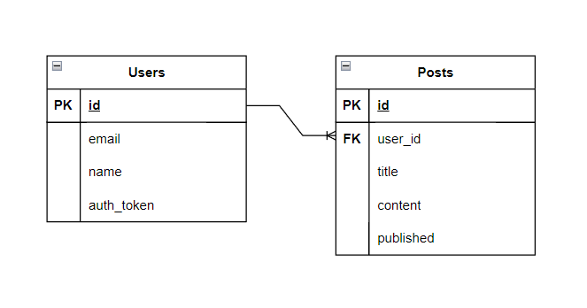

##  Rails-API
#### Diagram 


### Start the project
```
- Clone repository
- bundle install
- rails db:setup
- rails server
```


#### Endpoints
```
GET /posts?search=title (optional query)
```
```
GET /posts/{id}
```
```
GET /posts/unpublished
```
```
POST /posts
```
```
PUT /posts/{id}
```
Gems used:
* rspec-rails (integration with RSpec, testing framework)
* factory bot (creation of test data for models)
* faker (generate fake data)
* letter_opener (view mailer)

Additionally I implemented:
* Caching (search for a post)
* ActiveJob (background work)
* ActiveMailer (send report)
```
# report sending 
PostReportMailer.post_report(User.first, Post.first, PostReport.generate(Post.first)).deliver_now
```


